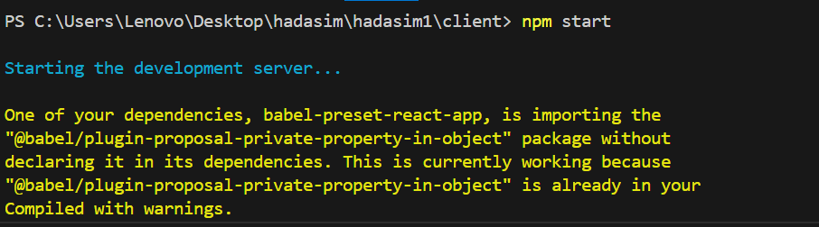

# hadasim

## אופן השימוש

להלן הוראות כיצד להריץ את האתר:

1. התקנה של התלויות החיצוניות:
npm install

2. הרצת האפליקציה:

כעת תוכלו לגשת לכתובת [http://localhost:3000](http://localhost:3000) בדפדפן כדי להשתמש באפליקציה.

## תלויות חיצוניות

הפרויקט משתמש בתלויות חיצוניות הבאות:

- `@emotion/react`: ספריית עיצוב Emotion עבור React.
- `@emotion/styled`: ספריית עיצוב Emotion עבור React.
- `@mui/material`: מימוש של Material Design באמצעות MUI ל-React.
- `axios`: ספריה לבצוע קריאות HTTP בצד הלקוח.
- `react`: ספריה המאפשרת פיתוח ממשקי משתמש בצד הלקוח באמצעות React.
- `react-dom`: ספריה המאפשרת להריץ אפליקציות React בדפדפנים.
- `react-scripts`: תסריטים להרצת יישום React.
- `web-vitals`: מדדי ביצועים וניטור לאתרים.

בנוסף, בשרת הפרויקט משתמש בתלויות חיצוניות הבאות:

- `body-parser`: מודול middleware לניתוב פעילויות ב-Express.
- `cors`: מודול middleware לאפשרות פעילויות Cross-Origin Resource Sharing (CORS) ב-Express.
- `express`: ספריה לבניית אפליקציות web ב-Node.js.
- `mongoose`: ספריה עבור קישור וניהול מסדי נתונים MongoDB ב-Node.js.

### התקנה והפעלת השירותים

1. התקנת התלויות:
npm install

2. הרצת השירות:

כעת השירות יהיה זמין על [http://localhost:5000](http://localhost:5000).

להוספת לקוח חדש

הצגת הנתונים על לקוחות וניהול מחיקה עדכון

ניהול חיסוני קורונה

הוספת סוג חיסון ויצרן

4 חיסוני קורונה מוגבלים הוספת חיסון
